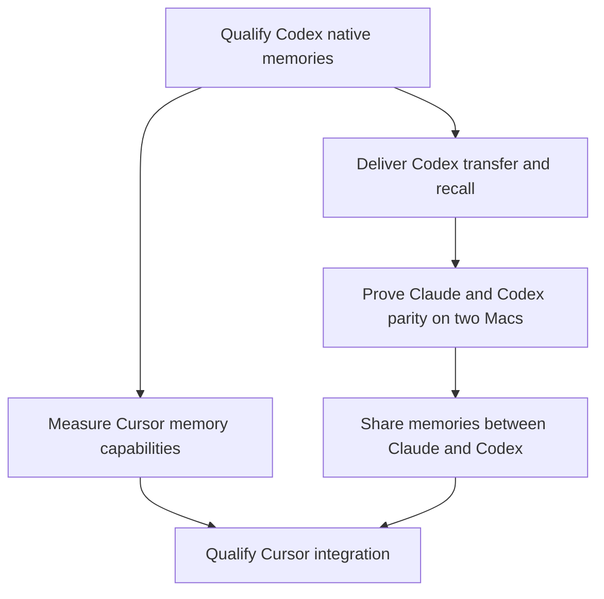
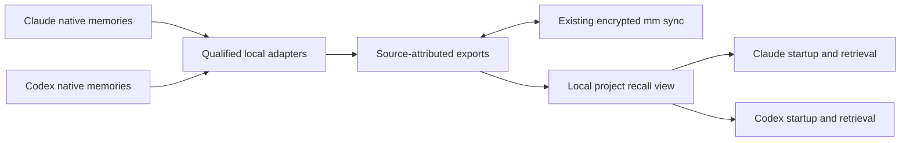

# Memory continuity across machines and agents

Status: formal implementation plan, 2026-09-30. Implementation has not started;
native adapter choices remain subject to the qualification gates below. Source inspection
baseline: `c43b777`; local Codex version at inspection: 0.159.0. Work is filed in
[Track 68A](../ROADMAP.md#track-68a-qualify-codex-memory-portability-and-recall)
for qualification; the remaining work packages are preserved in
[Future](../roadmap-future.md#codex-memory-sync) with explicit promotion gates.
The [2026-09-30 inbox drain](../TODOS.md#roadmap-drain--2026-09-30) records their
routing. Later work packages receive implementation Tracks after qualification.

## Outcome and scope

First make Claude and Codex comparable for memory capture, recall, and sync
across Macs. Then let either agent recall the other agent's memories for the
same product. Cursor follows after its actual memory capabilities are measured.

The motivating experience is: correct an agent while working on a product,
switch agents or Macs, and have the next session remember that correction
without repeating it. Project docs already preserve deliberate architectural
knowledge. This plan covers accumulated agent memory outside those docs;
it does not introduce another documentation hierarchy.

"Agent" here means the host application/integration: Claude Code, Codex, or
Cursor. The model selected within a host is optional provenance, not the
identity of a separate memory store.

Memory parity is a user outcome, not identical storage formats. Native recall
and recall through an mm integration must be distinguished in qualification.
A fallback integration is an explicit design decision, not something to label
native memory sync without evidence. This plan does not expand skills,
plugins, configuration, or usage-reporting parity.

**Forgetting and memory echoes are first-version requirements.** Both are
tested in the prototype, implemented in the initial transport/bridge, and
retested before release. A happy-path recall demonstration cannot waive either
gate. Semantic search and richer consolidation are later work; these two
correctness requirements are not. The hostile-content checks (H1-H4) are held
to the same standard.

## Evidence and unknowns

| Surface | Verified on 2026-09-30 | Still to establish |
|---|---|---|
| Claude | `manifest.walk_claude_source` walks project `memory/` and `todos/`; this Mac has 31 memory Markdown files in the Mind Meld memory directory | Recall after transfer to a different home path/new workspace; configured alternate memory roots |
| Codex sync | `config.DEFAULT_SOURCES` and this Mac's source select `skills/`, `plugins/`, and `AGENTS.md`; no memory path | A portable export and a receiving-host consumer |
| Codex in Conductor | Live processes run `codex app-server` and open `~/.codex/state_5.sqlite`; memory-enabled processes also open `~/.codex/memories_1.sqlite` | Qualification on another Mac and a fresh session |
| Codex generation | After the user enabled memories, `codex features list` reported `memories stable true`; four completed extraction rows had nonempty memory and summary content at inspection | Consolidation and successful recall; counts are a point-in-time observation |
| Codex artifacts | `memories/` contains `MEMORY.md`, `memory_summary.md`, `raw_memories.md`, an internal `.git/`, `extensions/ad_hoc/instructions.md`, and an empty `rollout_summaries/` directory | Which records and import surfaces are stable enough to integrate |
| Codex completion | The three main Markdown files still contained initialization placeholders while extraction rows existed and consolidation was pending | Do not equate a created file, enabled flag, or extraction job with usable recalled knowledge |
| Cursor | mm captures usage from Conductor's run store | Whether this integration produces portable memories; usage records are not memory records |

The initial empty-directory observation is superseded: generation is now
enabled locally and has produced extracted content. Enabling it in the shared
agent-config source was done by the user. Fleet deployment and recall remain
unverified; mm must not silently change host settings to make this feature work.

Observed database schemas and file names are version-specific evidence, not
public API guarantees. No private memory text or conversation data belongs in
this design or committed fixtures. Use sanitized fixtures that preserve the
measured structure.

Raw qualification artifacts (extraction rows, database copies, recalled text),
including the disposable `CODEX_HOME` that accumulates them, stay outside
ephemeral workspaces **and outside everything mm or iCloud syncs**. The set to
avoid is:

- every source configured in `config.toml`, including a custom source whose
  directory does not exist yet (`mm sources` lists a source only while its
  directory exists, so an experiment that creates the directory can start a
  sync);
- every source that is disabled, since it syncs again when re-enabled;
- every root in `config.DEFAULT_SOURCES`, existing or not, because mm adds a
  host's default source as soon as its directory appears;
- mm's own storage root, and iCloud-synced folders such as
  `~/Library/Mobile Documents/` and, when enabled, Desktop and Documents.

Verify by physical location, not path strings. Resolve the destination
completely (resolve its deepest existing ancestor and append the parts that do
not exist yet), then compare each ancestor of the resolved path with each root
by file identity (device and inode, for example `os.path.samefile`). Symlinks,
case-insensitive aliases and firmlinks defeat string containment, and a lexical
walk up the parents misses a symlink into a synced subtree. The default gstack
source syncs `~/.gstack/projects/`, so that directory is not a safe home for
raw memory content. `~/scratch/` is a candidate to verify, not an automatic
guarantee.

Never copy `auth.json`, `config.toml` (which can embed provider environment
variables) or any other credential-bearing file into an experimental
`CODEX_HOME`; write a minimal configuration by hand. If a run needs
credentials, record the mechanism in the source contract before the credentialed
run begins, and remove what it created, including any keyring entry, when the
run ends. If the host offers no such mechanism, the affected measurement is
unsupported. Delete the disposable home after the run.

OpenAI describes local memories as asynchronously generated state and advises
against hand-editing the generated files as the primary control surface. That
makes import and subsequent regeneration the first investigation, before
selecting files for transport. See the
[official memory documentation](https://learn.chatgpt.com/docs/customization/memories).

Claude documents a project index and topic files, with the index loaded at
startup and detailed notes read on demand. Its current documentation describes
shared memory across worktrees of a repository and an optional custom memory
directory. Verify those behaviors against the installed version and mm's
walker; documentation alone does not prove fleet path portability. See
[Claude memory storage](https://code.claude.com/docs/en/memory#storage-location).

## Constraints that shape the design

- Reuse the filesystem backend, content-addressed encrypted blobs, validated
  storage keys, and manifest publication boundary. No new server or plaintext
  sync payloads in iCloud.
- Preserve [sync invariants](../invariants/sync.md), especially complete
  snapshots, source consent, deletion proof, symlink handling, and previews.
  An unreadable source or a half-written consolidation is not an empty memory
  inventory and must never authorize deletions.
- Keep session databases, transcript files, credentials, job queues, locks,
  native Git history, and whole host configuration files local. A scoped,
  read-only database query may be part of a qualified local adapter; copying
  that database to peers is a different operation and is excluded.
- Generated indexes remain local views. The generated-files invariant already
  rejects syncing independently regenerated artifacts as competing user files.
  The transport needs a defined durable record/export contract first.
- `merge._merge_strategy` chooses `merge_lines` for **any** basename
  `MEMORY.md`. Codex's generated handbook must never enter that path. New
  portable records need explicit merge semantics, not a filename coincidence.
  See [conflict invariants](../invariants/conflicts.md).
- Memory publication and cross-agent exposure require explicit enrollment;
  existing consent for Codex customizations/usage does not silently enroll a
  broader memory payload. Native per-chat capture/use choices must be honored
  wherever the adapter can establish them; unknown consent is not permission.
- Project docs and current user instructions remain authoritative. Recalled
  content is attributed context, not a new instruction tier. Native forgetting,
  corrections, and user opt-out must remain meaningful after replication.
- Recalled memory is untrusted, attributed data, because it is LLM-summarized
  session content that a peer, or a poisoned tool output, may have shaped. It
  cannot grant tool permissions, override current user or project instructions,
  edit an instruction file, request or authorize a retirement, or enroll a
  project. Deliver it bounded and labeled with its origin, never as an
  instruction. Terminal sanitization is a separate, narrower control. The
  existing sink helpers remove ESC and C1 sequences so peer text cannot script
  a terminal; they are not an all-control guarantee, and they do **not**
  prevent prompt injection. Every new terminal print site follows the sink
  rules in [init-devices](../invariants/init-devices.md): `safe_str` for Rich
  markup, `safe_text` for diff content, and `safe_terminal_str` for
  single-line plain stderr. Delivery to an agent is a different sink that none
  of those three fits (open question 15). The hostile-content tests below
  cover both controls separately.
- New commands, flags, exit codes, output fields, wire records and
  configuration keys are classified under the
  [1.x compatibility contract](../invariants/auto-upgrade.md#compatibility-1x).
  If qualification classifies a new record format as format-changing, the
  crypto-init version byte in the reserved 0x03-0x0F window is its older-side
  gate, and the newer-side fleet gate extends the
  `_check_fleet_version_or_refuse` pattern, which today keys on
  `last_seen_version` and ignores registered peers that never pushed. Because
  retirement holds only if every peer that can publish honors it,
  qualification must state which peer versions honor retirement records and
  how enrollment is bounded for peers that cannot be gated that way.
- The exporter and the receiving consumer run on push and pull, so they follow
  the unattended-hook contract in [AGENTS.md](../../AGENTS.md) and
  [events and retro](../invariants/events-retro.md): `autopull` and `autopush`
  are silent on the happy path, never prompt, respect their budgets, and record
  a degraded breadcrumb for any new degradation. A failure like E4 or F3 on an
  unattended path must surface in `mm status`, not only in a hook's stderr.

## Work packages and release gates

Each row maps to a work package routed from the TODO inbox. The linked work
package defines its tasks; this table defines the deliverable and the evidence
needed to finish it. All
packages are pending. The prototype is part of qualification and the bridge
package, not permission to deploy an incomplete sync protocol.

| Work package | Depends on | Deliverable | Exit gate |
|---|---|---|---|
| [Qualify Codex memory portability and recall](../ROADMAP.md#track-68a-qualify-codex-memory-portability-and-recall) | None | Versioned adapter contract, sanitized live-source fixtures, isolated import/recall prototype | Native lifecycle measured; forgetting and ancestry capabilities established; unsafe integration candidates rejected |
| [Deliver Codex memory sync across Macs](../roadmap-future.md#codex-memory-sync) | Qualification | Export, encrypted transfer, receiving consumer, retirement and provenance controls | Two-way Codex recall; deterministic forgetting, echo and hostile-content gates below pass; native regeneration preserves the qualified behavior |
| [Qualify Claude and Codex memory parity across the fleet](../roadmap-future.md#memory-fleet-parity) | Codex transport | Dated two-Mac CLI/Conductor qualification report and regression tests | Full parity matrix, including offline forgetting, same-agent re-export and the hostile-content checks on the live two-Mac and Conductor path, passes on supported versions |
| [Share project memories between Claude and Codex](../roadmap-future.md#cross-agent-memory) | Fleet parity | Project identity, shared recall view, startup integration, required forget control | Fresh-session recall in both directions; live cross-agent forgetting and echo tests and the deterministic hostile-content tests pass; unsupported ancestry cannot auto-publish |
| [Establish Cursor's memory capability and portability contract](../roadmap-future.md#cursor-memory-contract) | Codex qualification for discovery; parity/bridge for integration | Measured capability matrix and qualified adapter or documented shared-view consumer | Same isolation, forgetting, echo and hostile-content gates; discovery alone does not claim Cursor implementation is complete |

The retirement and ancestry schema is fixed during qualification, before
transport is implemented. The prototype exercises the failure cases in
disposable stores first; the real two-Mac/host tests confirm those semantics
before enrollment expands. A failed gate leaves the affected capability off
and the package incomplete; it does not become post-prototype cleanup.

## Dependency order

### Qualify the native memory contract

Produce a source contract and a repeatable experiment before implementing sync.

1. Record host versions, resolved `CODEX_HOME`, relevant memory feature and
   capture/use controls, and whether the caller is CLI or Conductor app-server.
   Observe an eligible conversation through extraction, consolidation, and a
   fresh session recalling the result. Include a disabled/capture-opt-out chat.
2. Census actual records and ownership: per-thread extraction rows, consolidated
   summaries, supporting evidence, indexes, and manually authored extensions.
   Determine which records carry reliable project identity and which combine
   several projects or user-wide preferences. Do not infer a project by parsing
   an English summary or guessing from the current working directory.
3. Find a supported host import/extension surface and test it on a disposable
   host home. The observed ad-hoc extension and the disabled, under-development
   `external_agent_memory_import` flag are investigation leads only. Determine
   consumption, overwrite, forgetting, version-drift, and restart behavior.
4. Test import into an already populated receiving store, then allow its next
   consolidation to run. Both local and imported knowledge must remain
   retrievable. Copying the generated Markdown once is insufficient.
   Also retire the imported memory and run a recall-only session through native
   extraction: establish whether the host supports withdrawal and preserves
   imported ancestry. Use the [forgetting](#forgetting-and-corrections) and
   [echo](#preventing-memory-echoes) experiments as prototype gates.
5. Select the smallest supported adapter. Prefer native import when it passes
   these tests. If none exists, record that limitation and choose an mm-owned
   recall integration explicitly; do not patch native SQLite tables or create
   fabricated chat sessions to force an import.

Deliverables: sanitized source fixtures, a capability/compatibility note,
the chosen export/import contract, and the recall test recipe. Qualification
must include at least one actual Mind Meld memory; the first extraction rows
seen locally came from other products and establish generation only.

### Deliver Codex transport and recall

Build the exporter and its receiving consumer as one feature. An encrypted
backup with no agent consuming it is not the promised outcome.

The proposed transport is an mm-owned directory of versioned, source-attributed
memory exports outside workspaces. An adapter reads an allowed native source
consistently, emits a completed export, and an enrolled peer makes that export
available through the qualified recall surface. The adapter never downloads
foreign files directly over a live native generator's outputs.

Resolve the following in the source contract before writing production code:

| Decision | Required behavior |
|---|---|
| Unit of export | Smallest durable memory unit the native source can actually identify. If individual facts have no reliable identity, fall back only to a project-scoped export with enforceable ownership, a stable root identity, immutable revisions, retirement and ancestry semantics. Retirement then applies at the granularity of that export: the mm forget control retires the whole unit and the limitation is reported. A later native export that merely omits a fact never supersedes it (see Absence/removal), and F2 runs in this mode across a native regeneration in which the native store still holds the forgotten fact. Per-fact forgetting needs a native per-fact delete signal or an mm-owned capture path, and any successor or restoration path is open question 7. A copied generated handbook or a mixed-project dump is never that fallback |
| Ownership | Origin host/device owns its source export; every revision preserves its root identity and imported ancestry; received replicas and generated retrieval views are not newly authored memories |
| Revision | Stable source identifier plus immutable content revision and explicit supersession; preserve source date and observation date separately; peer clock alone does not choose truth |
| Publication | Read a consistent source revision, validate it, write atomically, and publish only a complete export through the existing encrypted manifest |
| Absence/removal | Distinguish explicit retirement from consolidation, filtering, unreadability, temporary emptiness, and source disable; unknown absence preserves the last accepted revision |
| Receiving host | Use a supported import/extension or separately documented mm recall integration; preserve native local content and host capture/use controls |
| Migration | Enroll new and existing installations deliberately, preserve existing source selections, and prevent exclude/disable changes from creating deletion tombstones |

Implement the [forgetting and echo contracts](#forgetting-and-echo-contracts)
in this package, and pass its
[hostile-content checks](#hostile-content-and-the-trust-boundary). These
contracts also apply to same-agent memory imported from another Mac; they do
not first appear when the second agent is connected.

No general-purpose semantic merger or extra model invocation belongs in the
first transport. Source revisions remain inspectable; conflicting statements
are preserved with provenance until their owner corrects or retires them.
Any new wire format needs version checks and rejection of unsupported records
before use. A parse failure must remain visible and cannot publish emptiness.

Likely code boundaries, to refine after qualification: a leaf adapter/export
module; source configuration and walkers; a narrow CLI integration for capture
and recall; existing storage/manifest primitives. Keep CLI imports one-way as
required by [AGENTS.md](../../AGENTS.md). Reuse `lockedjson` for any new local
JSON cache instead of inventing another locking implementation. New commands
must enter `COMMAND_INTENTS62` with defined inspection and preview behavior.

### Qualify parity on two Macs

Run the same scenarios for Claude and Codex, through direct CLI and Conductor.
Do not silently reinterpret Claude's existing path-based file sync as portable
project identity. Fix any measured gap needed for the agreed matrix.

| Scenario | Pass condition |
|---|---|
| Baseline recall | An agent uses a harmless, distinctive remembered fact in a fresh session without the prompt supplying that fact |
| A to B, then B to A | Both agents can independently recall the transferred facts; B's pre-existing memories survive |
| Workspace replacement | Recall survives archiving/recreating a Conductor workspace and a different checkout path |
| Different Mac home paths | Correct project association without requiring matching usernames or absolute directories |
| Offline concurrent work | Distinct facts survive convergence; conflicting facts retain provenance; repeat sync makes no new records |
| Correction and forgetting | A retired identity and its known derivatives stop being served after the control record is accepted; stale revisions cannot restore it when an offline peer returns; F1-F4 below pass |
| Memory echoes | Recall-only sessions and native consolidation cannot create new independent copies of imported memories; E1-E4 below pass for each enabled adapter |
| Native regeneration | Receiving-host consolidation does not discard imported knowledge or overwrite local memories |
| Consent and failure | Disabled capture, disabled recall, unsupported schema, unreadable source, and temporary empty output cannot masquerade as a completed usable transfer |
| Isolation | Another project's memories and unapproved user-global context are absent from the retrieved context |
| Hostile content | H1-H4 pass with the real host and receiving path, including a forged retirement or enrollment request inside a memory body |
| Preview | Existing write-free preview guarantees hold; preview does not trigger native generation, import, or new export directories |

Use adapter fixtures and two-device integration tests for deterministic
behavior. Actual host recall requires dated manual/agent qualification on real
Macs; unit tests cannot prove that a host consumed the context. Inspect the
loaded context or retrieval evidence as well as the answer to avoid treating
a guessed answer as recall. Use harmless test facts, not private user memories.

Verification commands for affected existing areas start with
`./bin/check tests/test_config.py tests/test_manifest.py tests/test_merge.py tests/test_integration.py tests/test_module_boundaries.py`;
add the new adapter tests when their paths exist and run the full `./bin/check`
before release. Capture/regeneration timing is measured, not guaranteed to
happen at session end.

## Forgetting and echo contracts

These are requirements for the first shipped transport and bridge. The record
encoding is chosen during qualification, but the semantics below are fixed.
Each adapter must demonstrate how it implements them before being enabled. The
hostile-content checks at the end of this section belong to the same contract.
Resolving the open questions below may add cases to a series (an F-case for
retirement records missing from a manifest, an E2 split by adapter mode, more H
cases); a reference to F1-F4, E1-E4 or H1-H4 elsewhere means that series as it
then stands.

### Forgetting and corrections

**Identity and authority.** A memory has a stable root identity scoped by
project, originating agent/device, and native source identifier. That identity
must survive a device re-registration (a new `device_id`) and a project alias
remap, or retirement must carry over across them (open question 17). Changes
create immutable revisions of that identity. Source ownership governs ordinary
updates; the enrolled user can retire a shared memory from either agent/Mac.
Peer-supplied text cannot itself request retirement or create user authority.
The forget and enroll controls must not be satisfiable by an agent acting on
recalled text. An interactive prompt alone does not qualify, because piped
stdin or a pty answers one. Qualification must name an approval channel outside
the agent's tool control, or record that none exists; until one is qualified,
an agent-run invocation of either control is unsupported and authors nothing.
The same rule covers a native delete: it becomes a retirement only when
qualification shows the delete was user-originated.

**Retirement wins.** A forget action writes a separate encrypted retirement
record targeting the root identity, not just the current content hash. The
retrieval projection excludes all revisions of that identity and any records
whose declared ancestry contains it. A stale update, newer mtime, repeated
export, or native regeneration does not reverse retirement. Restoration, if
later supported, requires an explicit user action and a new identity; it is
not inferred from a source file reappearing.

**Keep the evidence.** First-version retirement records have no automatic
expiry. Payload cleanup must retain them, and retired identifiers are never
reused. This deliberately avoids relying on the ordinary file-tombstone TTL
to cover an arbitrarily long offline Mac. Compaction of retirement metadata is
deferred until a proven peer-acknowledgment protocol can preserve the guarantee.

**Make withdrawal coherent.** Install memory entries and their control records
as one accepted local view before serving the new revision. Apply retirement
filtering before indexing and at retrieval; invalidate cached excerpts and
indexes. Unknown or unsupported control state makes the affected view
unavailable, not permissively live. The affected view is the one named by the
record's validated project scope, which is checked against the enrolled
projects and lives in the encrypted record header or manifest path; it is never
taken from a body a peer authored, and a project identifier never appears in a
plaintext storage key. When no scope validates, every enrolled project view on
the receiving Mac is unavailable, with a visible local remedy. Derived indexes
remain rebuildable local state. Disabling sharing hides records without
authoring retirements; an incomplete scan or empty consolidation cannot create
a forget action.

**Handle source changes deliberately.** A qualified native delete signal can
produce retirement. Mere disappearance during consolidation cannot. If the
native host cannot expose a trustworthy forget signal, a supported mm forget
control is required from the first release and native deletion propagation is
reported unsupported. A correction explicitly supersedes an older revision;
unrelated concurrent corrections are surfaced together until resolved rather
than selected by clock time. A retirement defeats concurrent ordinary updates.

**State the guarantee accurately.** Forget means no future delivery through
the enrolled shared-memory integration after it accepts the retirement. An
offline Mac learns of retirement on its next successful sync. Already-loaded
conversation context and retained backups are not retroactively erased.
Native imports are eligible only if their consumer can withdraw the imported
memory and its derived recall artifacts; otherwise use the controlled mm view
instead of claiming native forgetting. Project documentation and independently
learned facts are outside the identity being retired.

The prototype and release evidence must include:

| Test | Experiment | Pass condition |
|---|---|---|
| F1: offline resurrection | A exports a fact to B; B goes offline; A forgets it; B later publishes its stale copy before pulling A's retirement; repeat sync in both arrival orders | Once a peer accepts retirement, neither the root nor known derivatives appear in its index/context/retrieval; further sync cannot restore them |
| F2: regeneration and correction | Correct revision 1 to revision 2; run native consolidation; concurrently publish an older revision; then retire the identity | Supersession preserves the intended correction, retirement defeats all ordinary updates, and native imported copies do not remain in the qualified recall surface |
| F3: interrupted control update | Interrupt installation between payload and control processing; restart; include cached indexes and unsupported control versions | No partially accepted view serves retired content; unsupported/incomplete state is unavailable for the affected view |
| F4: absence is not forgetting | Exercise temporary empty output, unreadable source, exclusions, and sharing disable/re-enable; separately retire and garbage-collect payloads | Accidental absence creates no retirement; real retirement survives payload cleanup and re-enrollment on that Mac |

### Preventing memory echoes

**Keep origin across every hop.** Portable records carry root identity,
revision, and imported ancestry. A received record is a replica of its origin,
not a new memory authored by the receiving device. Origin timestamps and
authority are not refreshed merely because another agent read or restated it.
Exporters exclude mm's downloaded replicas and generated context/index files
from native discovery by construction.

**Deduplicate identity, not belief.** Repeating the same root/revision is
idempotent. Hashes detect exact duplicates as an additional check, but semantic
similarity is not a sufficient identity or independence test. A paraphrase
derived only from imported memory must not acquire independent origin or
extra weight. Native extraction may legitimately add new user feedback;
qualification must show how that is distinguished from a restatement.

**Use a conservative fallback.** Before enrolling a host/project for bridge
recall, establish whether its native extraction preserves imported ancestry.
If it does not, disable automatic export of native summaries for that
bridge-enabled host/project before delivering foreign context. Do not try to
guess which subsequent conversations were influenced. Previously qualified
original records can remain available, and new user-approved explicit capture
can be evaluated as a separate path. The implementation must expose this
restriction; it cannot claim transparent automatic bidirectional parity while
only a restricted consumer mode works. Native import into a global store that
cannot isolate the affected project requires the same restriction at the
broader host scope, or rejection of that import approach.

This fallback is a design decision to validate in the prototype, not an
unimplemented safeguard to add after release. An inability to preserve
ancestry blocks automatic publication of the affected source. It does not
justify allowing echoes and promising later cleanup.

| Test | Experiment | Pass condition |
|---|---|---|
| E1: repeated transit | Export A to B, recall there, export B to A, repeat the loop three times without new user information | After initial transfer, active independent memory identities and origins are unchanged; no content is promoted by repeated circulation |
| E2: paraphrased native output | Have the receiving agent restate the imported fact; let its real native extraction/consolidation run | The derived output retains ancestry and is suppressed as independent evidence, or the adapter's conservative publication block applies; hashes alone cannot satisfy the test |
| E3: genuinely new feedback | In a session that used imported context, provide a new user correction and repeat extraction/export | New authorized knowledge can be captured through the qualified route while the recalled fact is not duplicated; restrictions on automatic capture remain explicit |
| E4: loss of provenance | Restart with a changed/unknown native schema or output lacking expected ancestry | The affected automatic exporter stops before publication; neither the last accepted export nor unrelated sources are replaced with a fabricated empty snapshot |

### Hostile content and the trust boundary

Every memory a peer publishes, and every native summary derived from one, is
untrusted input. These deterministic checks are release gates alongside F1-F4
and E1-E4. They test the two controls separately: what the agent is allowed to
do with recalled content, and what a terminal is allowed to render. They prove
that framing, state and rendering hold; they cannot prove how a host model
behaves, which live qualification observes separately.

| Test | Experiment | Pass condition |
|---|---|---|
| H1: forged authority | A memory body, and a revision or summary derived from it, asks to retire an identity, enroll a project, grant a tool permission, override an instruction, edit an instruction file, run the forget or enroll control, or delete a native memory, and tries to forge its own origin label with a newline, delimiter or fake header. A peer-controlled `device_id`, project identifier or path component carrying newline, ESC, bidirectional or delimiter characters is added too, because the existing validators reject only path traversal | The retirement set, enrollment, permission grants and instruction files are unchanged by mm. An agent-run forget or enroll authors nothing, including one that answers a prompt through piped stdin or a pty or passes a bypass flag; a native delete without qualified user origin authors no retirement. The text is delivered only as bounded data inside a frame it cannot close, under an origin label built from a strict allowlist grammar (for example a fixed-length hexadecimal device short id and a defined project-identifier charset), never from peer-supplied names |
| H2: mis-scoped records | A record or control targets another project's identity, or has an unattributable or multi-project scope | It is rejected, and cannot retire, supersede or appear in another project's view. A memory record that cannot be scoped is not exported; a control record that cannot be scoped follows the fail-closed rule under Make withdrawal coherent |
| H3: forged or unsupported metadata | A record claims ancestry, origin, revision, or a control/schema version it cannot support | Unsupported control or schema state makes the affected view unavailable, as defined under Make withdrawal coherent; when the record's project scope validates, other views stay live. A memory record cannot gain independence, suppress unrelated identities, or count as a newer authority by claiming ancestry or origin it cannot support. Whether one unsupported control record may deny a project's recall fleet-wide is open question 7 |
| H4: instruction-like and terminal-control content | Recalled content mixes instruction-like text with ESC/C1/OSC/CSI sequences, CR, BEL, bidirectional and other invisible format characters, and Rich-markup lookalikes | Two separate assertions pass on rendered output, not on whether a sanitizer was called. First, each terminal print site the feature adds is free of ESC/C1 and shows the payload literally. `safe_str` and `safe_text` remove only ESC/C1, so CR, BEL and bidirectional or format characters still reach the terminal; a site that shows recalled content must neutralize them, as `safe_terminal_str` does for single-line output, and multi-line display needs a helper the qualification defines (open question 15). Second, delivery to the agent is bounded, attributed data that requests no privilege. Passing one never substitutes for the other |

H1 and H2 test the deterministic part of retirement authority. Who may author a
retirement, and how a peer proves it, is an open qualification question below.

Expected view state for the control-record cases, so a test author can decide
each one: an unsupported version whose project scope validates makes that view
unavailable and leaves every other view live; an unsupported version whose
scope does not validate makes every enrolled project view on the receiving Mac
unavailable; a record whose validated scope names project A but whose target
names project B is rejected and leaves A live.

Run F1-F4, E1-E4 and H1-H4 against sanitized deterministic fixtures in the
prototype, then record live host evidence for consolidation, recall, and
withdrawal. Hostile payloads are constructed in test code, never committed as
prose. The fixtures alone cannot establish native behavior. Execute the same
suite for same-agent transfer first and the Claude/Codex bridge second.
Assertions inspect
the actual delivered context and record lineage; an answer that guesses the
forgotten fact from code is not evidence of a transport failure.

## Cross-agent implementation

### Link memories across agents

**Recommended first implementation: an mm-owned project recall view over
source-attributed memories, with each native store retaining its own owner.**
Reuse the Codex exporter/consumer established above and add a Claude adapter.
This is a shared access layer; host-native memory formats need not become equal.

| Approach | Decision |
|---|---|
| Symlink Claude and Codex memory directories together | Reject: incompatible scope, native writers, indexes, and regeneration semantics |
| Copy each host's generated handbook into the other's store | Reject: source ownership and forgetting become ambiguous; generated files can be replaced or echoed back |
| Supported native cross-agent import | Evaluate during qualification; use only with proven scope, recall, and retirement semantics |
| mm-owned exports and project recall view | Preferred starting point: explicit boundaries, inspectable provenance, reuse of encrypted sync, and no live native-store overwrite |

The local data flow is:

**Project identity.** Start with one repository as one project. Resolve
worktrees through their common repository and normalize the credential-free
remote identity locally. Maintain an explicit project identifier/alias mapping
for remote renames, multiple remotes, forks, local-only repos, and intentional
multi-repo products; ambiguous mapping requires enrollment rather than guessing.
Raw cwd and home-directory paths stay local. Do not silently strip paths from
arbitrary prose and claim the remainder is portable; export only content whose
scope and path handling the source contract establishes. Unattributable or
multi-project records stay unshared. User-global memories require separate
explicit scope and are deferred from the initial project-only bridge.

**Record contract.** Implement the root identity, immutable revisions,
ancestry, supersession, and persistent retirement controls defined
[above](#forgetting-and-echo-contracts), alongside schema version, project
identifier, timestamps, and memory content. Keep machine-local native locators
outside the wire payload. The existing generic JSONL union merger alone does
not implement these semantics.

**Automatic discovery and bounded context.** Add a small,
hand-authored startup instruction through the existing shared
agent-config/project-instruction mechanism that resolves this project and reads
a bounded index. That file may sync like other agent configuration because it
holds only the static retrieval instruction. Retrieved memory content,
generated recall views, credentials and local enrollment state never enter it,
and the retrieval command enforces enrollment locally, so a Mac that has not
enrolled the project gets an honest unavailable result from the same
instruction. Installing the instruction is a user-approved change; mm does not
edit host settings silently. Load individual memories only when relevant.
Prototype CLI-based retrieval first; an MCP transport is an alternative if
needed, not a required server. Proposed commands such as
`mm memory context` and `mm memory show` are design examples and do not exist.
The receiving integration must be tested in Conductor and direct CLI; an
installed skill alone is not proof that every fresh session retrieves memories.
Declare the budget and truncation behavior during the prototype, showing where
additional memories can be retrieved. Missing mm or an unavailable store must
leave the agent usable with an honest unavailable result.

**Writes and feedback loops.** Each host continues authoring its own source;
the bridge initially reads foreign memories. Apply the automatic-publication
gate before exposing foreign context to an adapter without reliable ancestry.
The forget control is required in the initial release, through a qualified
native surface or an explicit mm operation. A common `remember` surface is a
candidate fallback for user-approved capture if native generation cannot meet
the ancestry contract; it is not a reason to omit the echo tests.

**Control and conflict.** Keep sharing selectable by project and source agent.
Turning off cross-agent sharing removes that source from retrieval without
deleting the native store. A correction/forget action targets the origin and
revision so it survives re-export and return of offline peers. A stale branch
observation must not silently become product-wide truth; retain scope/evidence
and let current code, docs, and user instructions override a recalled claim.

Acceptance includes a pair of fresh-session experiments: Claude-origin knowledge
used by Codex, then Codex-origin knowledge used by Claude, first on one Mac
and then on a second Mac/new workspace. All isolation scenarios and F1-F4 /
E1-E4 / H1-H4 must also pass for the enabled integration. This establishes useful sharing
before semantic consolidation, embeddings, ranking models, or automatic
promotion into project docs are considered.

### Extend to Cursor

Inspect the Cursor integration actually used in Conductor, recording the SDK
and host version. Its desktop, CLI, and SDK may expose different capabilities;
do not infer one from another. A run transcript or usage ledger is not a
memory API.

If a portable native store exists, apply the same source-contract, transport,
and recall tests. If only an instruction/retrieval integration exists, Cursor
can consume the shared project view with that limitation documented. Do not
add a native-memory sync source or a new `skill_link.AGENT_ROWS` entry without
evidence that the corresponding capability is present and needed.

## Decisions to resolve before implementation

1. Which Codex artifacts/import surfaces pass regeneration and forgetting tests?
   Local observations provide candidates, not the answer.
2. Can per-project memories and capture/use consent be recovered reliably from
   the native source without transporting sessions or user-global profiles?
3. Does native import satisfy the required experience, or must the same-agent
   parity milestone explicitly include an mm recall integration?
4. Which encoding and atomic install mechanism implement permanent retirement
   records, supersession, and cache invalidation? The first-version retention
   policy is already fixed: retirement evidence does not automatically expire.
5. Can native extraction preserve imported provenance well enough to avoid
   re-export loops? If not, demonstrate the required publication block and
   explicitly size any user-approved capture fallback before enabling sharing.

These are bounded qualification questions. The immediate next work is Track 68A
(qualification), not a blanket expansion of the Codex sync allowlist.

### Further questions retained for qualification and later packages

Track 68A settles what its evidence can settle. Each item below stays open, in
this plan, until a Track resolves it; none is decided by this document.

6. **Retirement versus deletion machinery.** Retirement records must outlive
   payload cleanup, yet manifests are complete snapshots and an absent file
   becomes a tombstone that expires after `manifest.TOMBSTONE_TTL_DAYS` (30
   days). Where do retirement records live so that a Mac that reinstalls, is
   newly enrolled, or publishes a manifest without them cannot erase the
   forgetting guarantee? Options include a distinct storage class or a field
   outside snapshot semantics. Add an F-test for "a Mac publishes a manifest
   without its retirement records". Confirm against the
   [sync invariants](../invariants/sync.md) that the chosen storage sits
   outside the snapshot and tombstone path, so an absent retirement record is
   never propagated as a deletion.
7. **Retirement authority and permanence.** Retirement records are published by
   peers under the fleet's shared symmetric key, which does not authenticate an
   individual author, and they never expire. What can a buggy or compromised
   peer suppress, and how does the user detect and recover from that? Can one
   unsupported or forged control record make a project's recall unavailable
   across the whole fleet, given that unknown control state fails closed? Decide
   whether a restoration or successor path exists, what identifies the enrolled
   user's own retirements, and which approval channel an agent cannot drive
   (see Identity and authority; piped stdin and a pty defeat a plain prompt).
   Which peer versions honor retirement records is governed by the
   compatibility constraint above.
8. **Project-identity ordering.** Codex transport scopes exports by project and
   parity needs correct association across different home paths, but the
   project identity contract appears only in the later bridge package, and
   Claude's path-encoded project directories cannot pass parity without it.
   Decide which package owns the minimal identity contract and whether the
   Claude identity fix belongs to parity or to the bridge.
9. **Ancestry-loss behavior against the acceptance clauses.** If native
   extraction cannot preserve imported ancestry, automatic export of native
   summaries is blocked, and a Future acceptance clause that requires a memory
   learned on Mac B to reach Mac A cannot be met without an explicit,
   user-approved capture path. Decide whether that path is in the transport
   package or the acceptance is restated. Split E2 by adapter mode: an
   ancestry-preserving adapter shows the paraphrase suppressed as independent
   evidence; a block-mode adapter shows the block keyed on actual ancestry loss,
   the restriction visible in `status` and `diag`, and the block in force before
   any foreign context is delivered.
10. **Proving recall safely.** A correct answer is not evidence of recall.
    Qualify an observation channel for the context the host actually loaded or
    retrieved. Each live scenario needs a positive control (the fact is
    delivered before retirement), a control arm with the memory absent, a trial
    count and pass threshold for nondeterministic runs, and a tri-state result
    (pass, fail, inconclusive because consolidation has not run). Record host
    and Conductor versions, date and device short id beside every measurement,
    since two Macs already differ in configuration. Run F1 and F2 over a stale
    revision whose clock is older, equal, newer and far in the future, because
    a peer clock alone must not choose truth.
11. **What the prototype proves, and where it lives.** Track 68A declares no
    source module, so the prototype protocol model can only sit in a tests-only
    harness. State that passing proves the protocol model and not the
    production transport or native recall. Prefer an adapter-conformance suite
    that the transport and bridge Tracks re-run against production code, and
    keep deliberately broken reference models (mtime wins, hash-only identity,
    retirement inferred from absence, bodies parsed for authority) that each F,
    E and H test must fail.
12. **Fixtures and the contract document.** Native stores include a nested
    `.git` and SQLite in WAL mode, which cannot be committed as reviewable
    fixtures and can retain deleted text. Generate structural fixtures from
    committed DDL and synthetic rows, allowlist every committed value, and
    check that none holds a home path, email, or prose. The Track 68A card
    places the source contract at `docs/designs/codex-memory-contract.md`,
    while the existing host-session fixtures keep a `CONTRACT.md` beside them.
    Keep the card's placement unless qualification shows a reason to co-locate,
    and either way pin each fixture directory and its recorded host version to
    the contract with a test, as the existing `CONTRACT.md` tests do.
13. **Transport gate completeness.** The Codex transport exit gate must itself
    cover cross-project isolation, capture/use opt-out, unsupported-version
    rejection, unreadable or empty source never publishing emptiness, and a
    check that memory payloads reach storage only as encrypted blobs. The
    parity table repeats some of these for live use, but the first shipped
    transport cannot pass without the deterministic versions. A `codex` source
    configured with `memories` in `include_dirs` also reaches the basename
    `MEMORY.md` line-union today; decide whether to reject that configuration
    or bypass the merger for it.
14. **The startup instruction: channel, pinning and remedies.** The instruction
    may sync as static, hand-authored agent configuration, so decide what pins
    it to the qualified text and how a changed copy is noticed. Its "never
    enters" list covers retrieved content, generated recall views, credentials
    and local enrollment state, and should also cover project identifiers and
    machine-local paths. Establish which channel actually carries it: on this
    Mac, at inspection, `~/.codex/AGENTS.md` is a symlink into a dotfiles
    repository, and mm's walker does not sync symlinks below a source root, so
    the carrier may be git and not mm. An honest "unavailable" result is read
    by an agent, so enrollment must not be an action the agent can invoke from
    a remedy string.
15. **The agent-facing delivery sink.** Recalled content that reaches an agent
    is neither a Rich markup site, a diff body nor single-line stderr, so none
    of the three terminal helpers fits. `safe_str` and `safe_text` remove only
    ESC/C1 and leave CR, BEL and bidirectional or format characters in place,
    while `safe_terminal_str` renders those characters and newlines as visible
    ASCII notation, which alters the payload instead of delivering it. Terminal
    display of multi-line memory, such as a proposed `mm memory show`, has the
    same need; the existing composition for a Rich sink is
    `safe_str(safe_terminal_str(x))`. Define the framing (bounded, delimited, a
    frame the payload cannot close), the origin label (built from an allowlist
    grammar, never a peer-supplied display name such as `device_name`), and what
    is neutralized, then test it under H1 and H4.
16. **The Claude adapter's own census.** The bridge adds a Claude adapter over
    project memory directories, but qualification censuses only Codex. Claude's
    per-project memory can hold typed entries (user, feedback, project,
    reference), and a live directory can mix personal preferences and
    machine-specific notes with project knowledge, so directory membership is
    not project scope. Census Claude's records and use their type as one scope
    signal before the bridge. Until then, user-type and unattributable entries
    stay unshared by default.
17. **Identity stability.** Root identity includes the originating device, and
    `devices.py` mints a fresh `device_id` on every registration, while the
    project identifier can be remapped for remote renames and forks. A retired
    memory must stay retired after a Mac is re-initialized or a project alias
    changes, so decide which inputs are stable enough to derive identity from,
    or how retirement carries across a remap. Add F-cases for "a Mac
    re-registers with a new device_id" and "the project remote is renamed or
    aliased".
18. **Coexistence with the existing raw Claude memory sync.** The claude source
    already syncs each project's `memory/` directory as ordinary files:
    `manifest.walk_claude_source` publishes it, `_apply_incoming_file` writes
    peer bytes into the native directory, and `merge._merge_strategy` line-unions
    any `MEMORY.md`. Retirement never reaches that path, so it can carry a
    retired memory or bring back index lines, and mixed-fleet peers keep
    republishing the raw files. Decide what happens to that sync once the Claude
    adapter is enabled for a project (narrow or disable it, or identify replicas
    from pull-history or accepted-manifest evidence), and extend E1 and F1 to the
    Claude native-directory path. The statement that exporters exclude mm's
    downloaded replicas by construction cannot be assumed for Claude until then.

The [Track 68A card](../ROADMAP.md#track-68a-qualify-codex-memory-portability-and-recall)
carries this document in its read-first list so these questions travel with the
work. Later regenerations size the packages once the answers are recorded.
